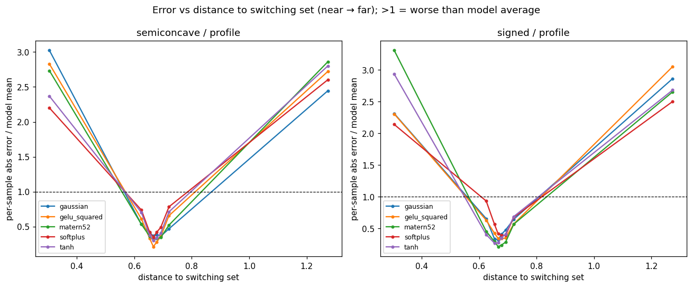

# region_split_pendulum Results

Region split scored over the **full dataset** on the live as-fit model. `near` = lowest 10% of samples by distance to the switching set; `far` = the rest. See `README.md` for the error-metric rationale.

## Mean per-sample L1 (primary)

`near/far` > 1 ⇒ worse at the switching set. Region mean per-sample L1 (absolute) error / global mean ‖true‖ — count-fair and robust to the V→0 interior.

Mean per-sample L1 over the full dataset — count-fair, robust to V→0

| kind        | insertion | activation   | loss | gamma | neurons | near L1  | far L1   | near/far |
| ----------- | --------- | ------------ | ---- | ----- | ------- | -------- | -------- | -------- |
| semiconcave | profile   | softplus     | h1   | 0     | 12      | 5.27e-01 | 1.79e-01 | 2.94     |
| semiconcave | profile   | tanh         | h1   | 1     | 39      | 2.82e-01 | 8.62e-02 | 3.27     |
| semiconcave | profile   | matern52     | h1   | 1     | 37      | 2.79e-01 | 6.72e-02 | 4.15     |
| semiconcave | profile   | gelu_squared | h1   | 1     | 18      | 1.98e-01 | 4.55e-02 | 4.36     |
| semiconcave | profile   | gaussian     | h1   | 0     | 16      | 2.41e-01 | 5.12e-02 | 4.71     |
| signed      | profile   | softplus     | h1   | 1     | 117     | 2.97e-01 | 1.06e-01 | 2.79     |
| signed      | profile   | gaussian     | h1   | 0     | 128     | 7.74e-02 | 2.42e-02 | 3.20     |
| signed      | profile   | gelu_squared | h1   | 1     | 58      | 2.15e-01 | 6.73e-02 | 3.20     |
| signed      | profile   | tanh         | h1   | 0     | 116     | 2.14e-01 | 4.53e-02 | 4.71     |
| signed      | profile   | matern52     | h1   | 1     | 112     | 1.73e-01 | 2.96e-02 | 5.83     |

## Error vs distance to switching set (diagnostic)

## Relative H1 (kept for continuity — confounded)

Relative H1 (kept for continuity — confounded by the V→0 interior)

| kind        | insertion | activation   | loss | gamma | neurons | near H1  | far H1   | near/far |
| ----------- | --------- | ------------ | ---- | ----- | ------- | -------- | -------- | -------- |
| semiconcave | profile   | softplus     | h1   | 0     | 12      | 1.81e-01 | 2.47e-01 | 0.73     |
| semiconcave | profile   | tanh         | h1   | 1     | 39      | 1.15e-01 | 1.26e-01 | 0.91     |
| semiconcave | profile   | gelu_squared | h1   | 1     | 18      | 7.85e-02 | 7.23e-02 | 1.09     |
| semiconcave | profile   | gaussian     | h1   | 0     | 16      | 8.29e-02 | 6.95e-02 | 1.19     |
| semiconcave | profile   | matern52     | h1   | 1     | 37      | 1.38e-01 | 1.07e-01 | 1.29     |
| signed      | profile   | gelu_squared | h1   | 1     | 58      | 9.40e-02 | 1.03e-01 | 0.92     |
| signed      | profile   | softplus     | h1   | 1     | 117     | 1.35e-01 | 1.32e-01 | 1.02     |
| signed      | profile   | gaussian     | h1   | 0     | 128     | 4.07e-02 | 3.64e-02 | 1.12     |
| signed      | profile   | tanh         | h1   | 0     | 116     | 7.29e-02 | 6.23e-02 | 1.17     |
| signed      | profile   | matern52     | h1   | 1     | 112     | 7.20e-02 | 5.10e-02 | 1.41     |
